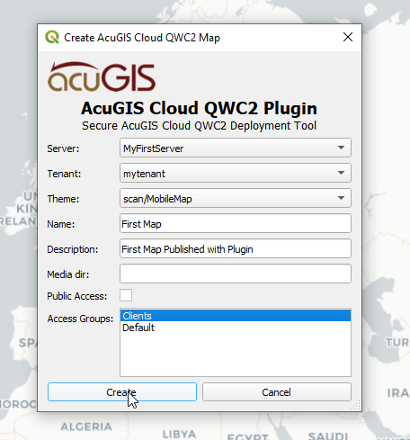
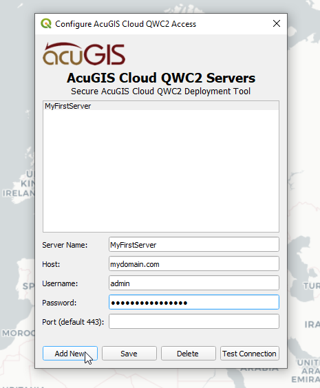
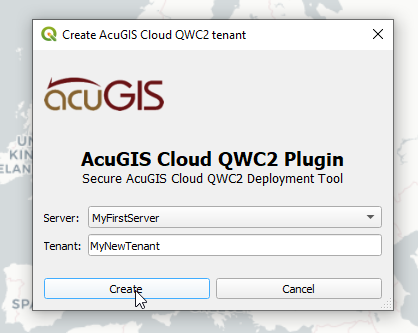
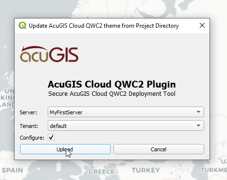

# QGIS QWC2 Login App Plugin

Menu.png
Publish.png
Tenant.png
Upload.png

AcuGIS [QWC2 Login App](https://git.sh8.eu/LymonHead/qwc2_login_app/) Plugin for QGIS is a plugin for tranfering contents of a QGIS Project to a QWC2 Login App tenant.

## Features

- Store multiple servers access details
- Transfer entrire directory contents, including sub folders.
- Uses chunks for uploads, to support very large files

## Uses:

- Any case in which you wish to transfer project directory to a AcuGIS Cloud QWC2 server

## Installation

Download qwc2_qgis_plugin.zip to your desktop

In QGIS, go to Plugins > Manage and Install Plugins and click on "Install from Zip" in left menu.

Browse to location where you saved qwc2_qgis_plugin.zip and then click "Install Plugin"

Once installed, you should see the Plugins menu.

Plugin location /home/$USER/.local/share/QGIS/QGIS3/profiles/default/python/plugins/qwc2_qgis_plugin

## Configure Servers:

- Begin by selecting 'Configure Access':

- Click Add to add server(s).

- Enter Server information

- Click Save.

## Create Tenants

## Upload to QWC2

Go to 'Upload Project Directory to Tenant'

Select the Server you wish to upload to.
Select the Tenant you wish to upload to.
Click Upload

.. note::
    Plugin uses file modification time to decide, if a file has to be uploaded.
    
A success message will be displayed up completion.

## Publish Your Map

## Toolbar Icons:

## Plugin Menu:

## Use Cases

The plugin is generic and can be used for publishing a QGIS Project directory to remote AcuGIS Cloud QWC2 servers.
